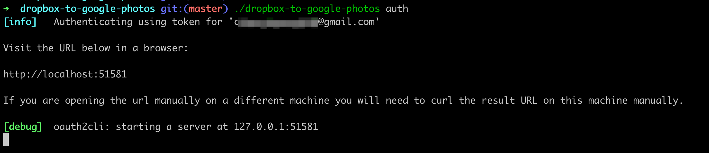
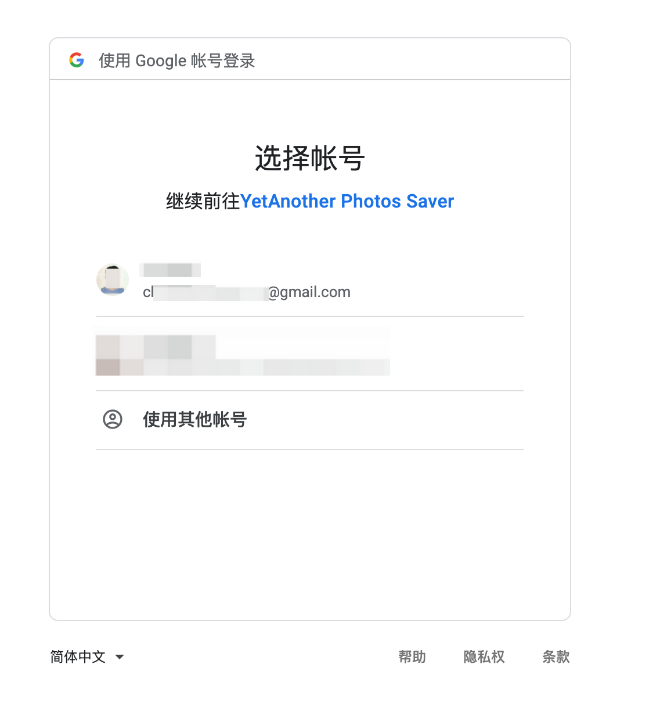
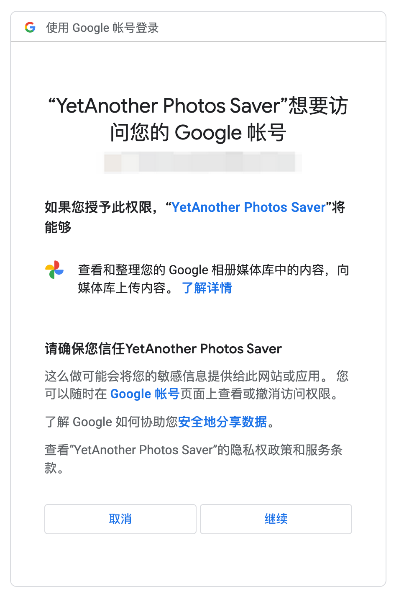

# dropbox-to-google-photos

save dropbox pictures and videos to google photos

## Installation

```bash
go install github.com/chyroc/dropbox-to-google-photos@latest
```

## Usage

## Google Photos OAuth Config

- click [google cloud create project](https://console.cloud.google.com/projectcreate) to create google photos oauth
  project
- click [photoslibrary.googleapis](https://console.cloud.google.com/apis/library/photoslibrary.googleapis.com) to enable
  google photos api
- click [google oauth app](https://console.cloud.google.com/apis/credentials/consent/edit;newAppInternalUser=false) to
  create google oauth app

Then you can get a google ooauth app id and secret.

### Init config

```bash
dropbox-to-google-photos init
```

default config file is `~/.dropbox-to-google-photos/config.json`

open config file and fill in the blanks

```json
{
  "account": "someaccount@gmail.com",
  "google_photos": {
    "client_id": "client id",
    "client_secret": "client secret"
  },
  "dropbox": {
    "token": "dropbox token",
    "root_dir": "/"
  },
  "worker": 20
}
```

- account: your email
- google_photos.client_id: google oauth app id
- google_photos.client_secret: google oauth app secret
- dropbox.token: dropbox token
- dropbox.root_dir: dropbox root dir
- worker: worker count(upload goroutine num)

### Auth google photos

```bash
dropbox-to-google-photos auth
```

|                               |                               |                               |
|-------------------------------|-------------------------------|-------------------------------|
|  |  |  | 

### Sync dropbox to google photos

```bash
dropbox-to-google-photos sync
```

## Thanks

- [google-photos-api-client](https://github.com/gphotosuploader/gphotos-uploader-cli)